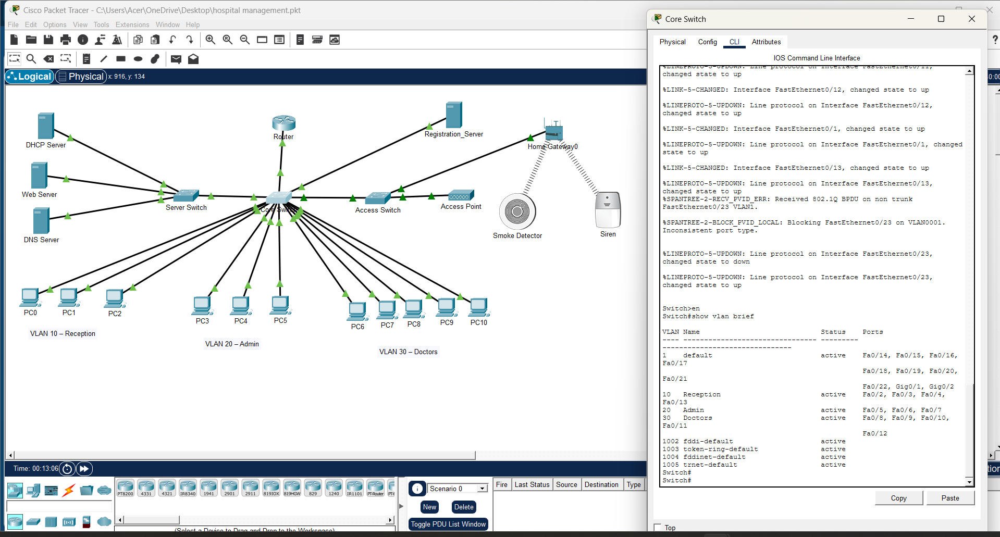
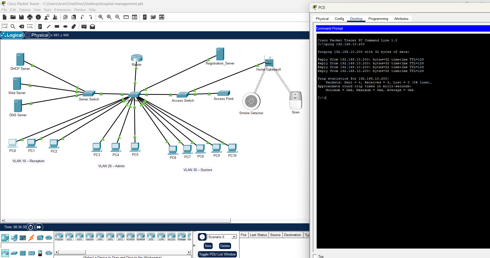

### VLAN Configuration Verification using show vlan brief command

## Description:
The output confirms that VLAN 10 (Reception), VLAN 20 (Admin), and VLAN 30 (Doctors) were successfully created and the switch ports were assigned to their respective VLANs.

---

### Registration Server Connectivity Test

## Description:
Successful Connectivity Test Between PC and Registration Server  
The ping test confirms successful communication between the workstation and the Registration Server (192.168.10.200). All packets were transmitted and received successfully with 0% packet loss, verifying proper network connectivity.

